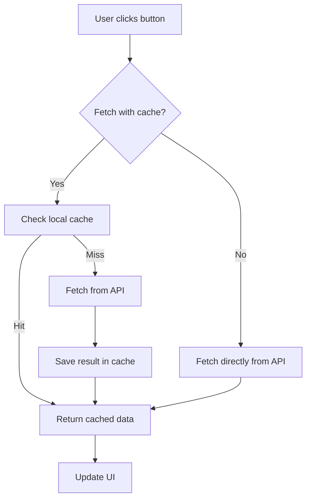

# 🔄 React Cache Experiments

A small project to explore different caching strategies in **React**.  
The goal is to understand how libraries like **React Query** or **SWR** work under the hood, starting from simple custom hooks to more global solutions.

---

## 📚 What’s inside?

This project shows different approaches to caching:

- ✅ **Local cache with a custom hook** – `useLocalCache`
- 🌍 **Global cache with Context API** – share data across components
- ⚡ **Library-based caching** – compare with `react-query` or `swr`

---

## 🖥️ Screenshots

### Local cache demo

### Without cache

---

## 🔄 How caching works (simple flow)

