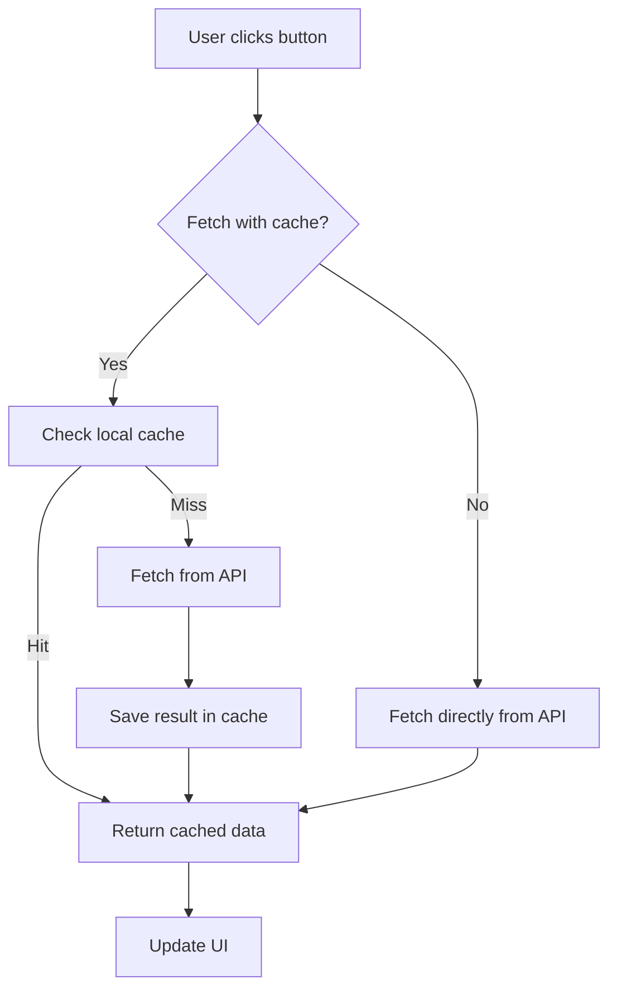

# 🔄 React Cache Experiments

A compact, educational project to explore different caching strategies in **React**.  
The aim is to understand how caching libraries like **React Query** and **SWR** work under the hood by building minimal, focused examples:

- a local-per-hook cache,
- a global cache using Context API,
- and a demo using a popular caching library.

---

 

> Quick demo app showing how data caching behaves in small, easy-to-read examples.

---

## What's inside

This repo contains three minimal demos that illustrate caching approaches:

- ✅ **Local cache** — `useLocalCache` (cache lives inside the hook / component instance)
- 🌍 **Global cache** — `CacheProvider` + `useCache` (shared cache via Context)
- ⚡ **Library demo** — example using **SWR** (or **React Query**) to compare behavior

Each demo uses the same endpoint (`https://randomuser.me/api/`) to keep outputs consistent for comparison.

---

## Screenshots

> Replace these placeholders with your actual screenshots inside `/assets`.

### Local cache demo

### Global cache demo

### Library demo (SWR / React Query)

---

## How caching works (flow)

Simple flowchart that explains the decision path for "fetch with cache" vs "fetch without cache".

